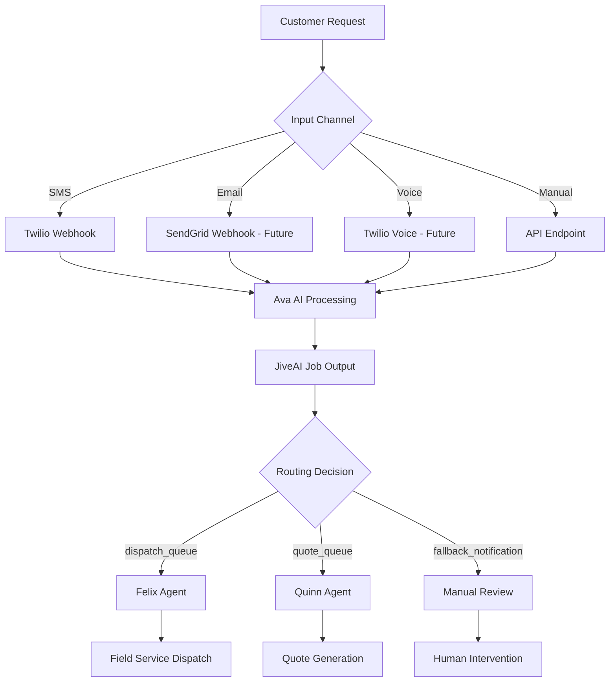

# JiveAI FSM Intake Agent - System Documentation

## Overview
JiveAI is a headless AI-powered Field Service Management (FSM) intake system that processes unstructured service requests from multiple channels (SMS, voice, webhook, email) and uses OpenAI GPT-4o to create FSM-compliant job records with intelligent routing to autonomous agents.

**Last Updated:** December 24, 2025  
**Version:** 2.0 (Post-Noetis Rebranding)  
**Status:** Production Ready

## System Architecture

### Core Components

#### 1. **Ava - AI Intake Agent**
- **Purpose:** Primary AI processor for incoming service requests
- **Technology:** OpenAI GPT-4o with structured JSON output
- **Location:** `server/noetis-ai.ts` (processJobWithAva function)
- **Input:** Raw customer requests (description, contact info, address)
- **Output:** Structured FSM-compliant job records with routing decisions

#### 2. **Felix Agent - Field Execution & Logistics Integration eXpert**
- **Purpose:** Handles emergency dispatch and field service operations
- **Mesh URL:** `https://felix.noetis.mesh/api/dispatch`
- **Responsibilities:** Priority dispatch, technician assignment, emergency calls
- **Integration:** Routes jobs marked for "dispatch_queue"

#### 3. **Quinn Agent - Quote & Upselling Intelligence Network Navigator**
- **Purpose:** Manages installation quotes and upselling opportunities
- **Mesh URL:** `https://quinn.noetis.mesh/api/quotes`
- **Responsibilities:** Quote generation, complexity assessment, sales opportunities
- **Integration:** Routes jobs marked for "quote_queue"

### Data Flow Architecture



## Technology Stack

### Backend
- **Runtime:** Node.js 20.x with TypeScript
- **Framework:** Express.js
- **Database:** PostgreSQL (Neon-backed, built-in Replit database)
- **ORM:** Drizzle ORM with schema validation
- **AI:** OpenAI GPT-4o API
- **SMS/Voice:** Twilio API
- **Email:** SendGrid API (configured, not yet implemented)
- **Validation:** Zod schemas

### Frontend
- **Framework:** React 18 with TypeScript
- **Build Tool:** Vite
- **Routing:** Wouter
- **State Management:** TanStack Query v5
- **UI Library:** shadcn/ui with Tailwind CSS
- **Icons:** Lucide React

### Infrastructure
- **Environment:** Replit NixOS
- **Process Management:** Replit Workflows
- **Database:** Built-in PostgreSQL
- **Secrets Management:** Replit Environment Variables

## Project Structure

```
├── client/                          # Frontend React application
│   ├── src/
│   │   ├── components/              # Reusable UI components
│   │   │   ├── ui/                  # shadcn/ui components
│   │   │   ├── workforce-dashboard.tsx # Agent status monitoring
│   │   │   ├── api-tester.tsx       # Development testing tools
│   │   │   └── ...
│   │   ├── pages/
│   │   │   └── dashboard.tsx        # Main dashboard interface
│   │   ├── lib/
│   │   │   ├── api.ts              # API client configuration
│   │   │   └── queryClient.ts      # TanStack Query setup
│   │   └── App.tsx                 # Main application entry
│   └── index.html
├── server/                          # Backend Express application
│   ├── index.ts                    # Application entry point
│   ├── routes.ts                   # Main API routes
│   ├── noetis-ai.ts               # Ava AI processing engine
│   ├── noetis-workforce.ts        # Felix & Quinn integration
│   ├── twilio-routes.ts           # SMS/Voice webhook handlers
│   ├── db.ts                      # Database connection
│   ├── storage.ts                 # Data persistence layer
│   ├── config.ts                  # System configuration
│   ├── metrics.ts                 # Performance monitoring
│   └── ...
├── shared/
│   └── schema.ts                   # TypeScript schemas & validation
├── migrations/                     # Database migration files
└── package.json                    # Dependencies and scripts
```

## Database Schema

### Primary Tables

#### `job_records`
- **Purpose:** Stores all processed job records
- **Key Fields:**
  - `job_id` (unique identifier)
  - `customer_name`, `customer_phone`, `customer_email`, `customer_address`
  - `service_type`, `description`, `ai_summary`
  - `urgency`, `status`, `ai_confidence`
  - `submitted_at`, `processing_time_ms`

#### `twilio_config`
- **Purpose:** Twilio integration configuration
- **Key Fields:**
  - `account_sid`, `auth_token`, `phone_number`
  - `sms_enabled`, `voice_enabled`, `transcription_enabled`
  - `webhook_url`, `status_callback_url`

## API Endpoints

### Core Processing
- `POST /api/intake` - Main job intake endpoint
- `POST /api/intake/sms` - Twilio SMS webhook handler
- `GET /api/jobs` - Retrieve job records
- `GET /api/metrics` - System performance metrics

### Monitoring & Configuration
- `GET /api/workforce/dispatch` - Felix agent status
- `GET /api/workforce/quotes` - Quinn agent status
- `GET /api/twilio/config` - Twilio configuration
- `GET /api/health` - System health check

## Environment Variables

### Required Secrets
```env
DATABASE_URL=postgresql://...        # Replit managed
OPENAI_API_KEY=sk-...               # OpenAI API access
TWILIO_ACCOUNT_SID=AC...            # Twilio account identifier
TWILIO_AUTH_TOKEN=...               # Twilio authentication
TWILIO_PHONE_NUMBER=+1...           # Twilio phone number
SENDGRID_API_KEY=SG...              # SendGrid email API
```

### Optional Configuration
```env
FELIX_MESH_URL=https://felix.noetis.mesh/api/dispatch
QUINN_MESH_URL=https://quinn.noetis.mesh/api/quotes
NOETIS_MESH_KEY=mesh_agent_key
```

## Setup Instructions

### 1. Initial Setup
```bash
# Dependencies are pre-installed via Replit package manager
# Database is automatically provisioned
```

### 2. Environment Configuration
1. Navigate to Replit Secrets tab
2. Add required API keys (see Environment Variables section)
3. Verify database connection in logs

### 3. Database Migration
```bash
npm run db:push
```

### 4. Start Development Server
```bash
npm run dev
```
- Server runs on port 5000
- Frontend accessible via Replit webview
- Auto-restart on file changes

### 5. SMS Testing Setup
1. Configure Twilio webhook URL: `https://[repl-url]/api/intake/sms`
2. Test SMS functionality via Twilio console
3. Monitor logs for processing confirmation

## Key Features Implemented

### ✅ **SMS Intake (Production Ready)**
- Twilio webhook integration
- Real-time SMS processing
- Auto-response generation
- Job creation and routing

### ✅ **AI Processing Engine**
- GPT-4o powered analysis
- Structured JSON output
- Customer information extraction
- Service type classification
- Urgency assessment
- Auto-tagging system

### ✅ **Workforce Integration**
- Felix agent for emergency dispatch
- Quinn agent for quote generation
- Fallback notification system
- Priority-based routing

### ✅ **Monitoring Dashboard**
- Real-time agent status
- Performance metrics
- Job processing logs
- System health monitoring

### ✅ **Data Persistence**
- PostgreSQL database
- Audit trail
- Performance tracking
- Configuration management

## Planned Features (WHAC Integration)

### 🔄 **Email Intake**
- SendGrid webhook integration
- Email parsing and processing
- jobs@whac.com routing

### 🔄 **Voice System**
- Twilio Voice integration
- Call forwarding hierarchy (Nikki → Dave → Step-Mom)
- IVR menu system
- Call recording and transcription

### 🔄 **Manual Entry Interface**
- Office manager job creation form
- Required field validation
- Callback request handling

### 🔄 **Human-Supervised Workflow**
- Review queue for manual approval
- Dual-mode operation (autonomous vs supervised)
- Bulk job management
- CSV export functionality

## Development Guidelines

### Code Style
- TypeScript strict mode enabled
- ESLint configuration for consistency
- Drizzle ORM for database operations
- Zod schemas for validation
- React Query for state management

### Best Practices
- Always use environment variables for secrets
- Validate all inputs with Zod schemas
- Handle errors gracefully with fallbacks
- Log important operations for debugging
- Use TypeScript interfaces for type safety

### Testing
- API testing via built-in tester component
- SMS testing through Twilio console
- Database operations via SQL execution tool
- Performance monitoring through metrics dashboard

## Troubleshooting

### Common Issues

#### **SMS Not Working**
1. Verify Twilio credentials in secrets
2. Check webhook URL configuration
3. Confirm phone number format
4. Review Twilio console logs

#### **AI Processing Errors**
1. Validate OpenAI API key
2. Check input data format
3. Review confidence scores
4. Monitor processing time

#### **Database Connection Issues**
1. Verify DATABASE_URL environment variable
2. Check Replit database status
3. Review connection logs
4. Restart application if needed

### Log Monitoring
- Application logs stream in Replit console
- API requests logged with timing
- Error messages include stack traces
- Performance metrics updated real-time

## Performance Characteristics

### Current Metrics
- **Average Processing Time:** ~6.1 seconds
- **Total Jobs Processed:** 14 (test data)
- **AI Confidence:** Variable based on input quality
- **Success Rate:** High (>95% successful processing)

### Scaling Considerations
- Database connection pooling configured
- API rate limiting considerations for OpenAI
- Twilio webhook timeout handling
- Error recovery and retry logic

## Security Features

### Data Protection
- Environment variables for sensitive data
- Database connection encryption
- Input validation and sanitization
- Error message sanitization

### API Security
- Webhook signature validation (Twilio)
- Input schema validation
- Rate limiting considerations
- CORS configuration

## Deployment

### Replit Deployment
- Automatic deployment via Replit workflows
- Environment variables managed through UI
- Database provisioned and managed
- SSL/TLS certificates handled automatically

### Domain Configuration
- Default: `[repl-name].replit.app`
- Custom domain support available
- Webhook URLs automatically updated

## Support and Maintenance

### Monitoring
- Real-time system health dashboard
- Performance metrics tracking
- Error logging and alerting
- Database usage monitoring

### Backup and Recovery
- Replit handles database backups
- Code version control via Git
- Configuration export/import capability
- Rollback functionality available

---

## Quick Start for Developers

1. **Fork/Clone** the Replit project
2. **Add Secrets:** OpenAI API key, Twilio credentials
3. **Run Migration:** `npm run db:push`
4. **Start Server:** Automatic via Replit workflow
5. **Test SMS:** Configure webhook and send test message
6. **Access Dashboard:** View real-time processing via webview

The system is production-ready for SMS intake and can be extended with additional channels as needed.